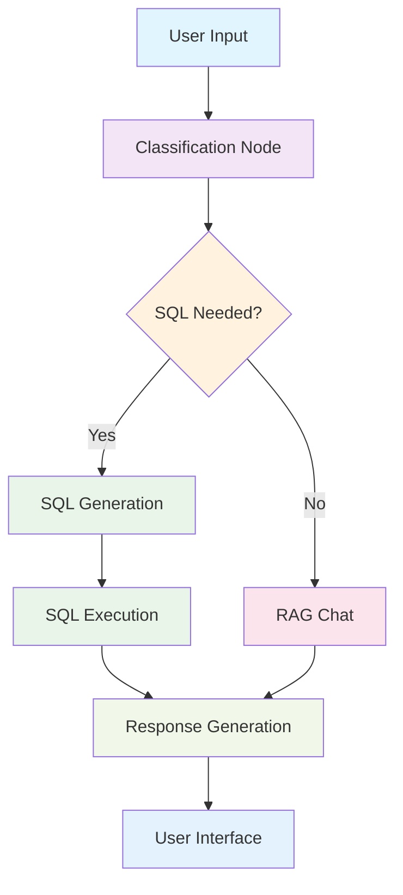

# 🤖 Agentic RAG with SQL

> **Intelligent Database Conversations with Retrieval-Augmented Generation**

[](https://www.python.org/downloads/)
[](https://streamlit.io/)
[](https://langchain.com/)

<div align="center">


**Transform your database queries into natural conversations with AI-powered intelligence**

</div>

---

## 🚀 **What Makes This Special?**

This project combines the power of **Retrieval-Augmented Generation (RAG)** with **SQL query generation** to create an intelligent chatbot that can:

- 🧠 **Smartly classify** whether a question needs SQL or general knowledge
- 🔍 **Automatically generate** and execute SQL queries
- 📚 **Leverage RAG** for contextual database insights
- 💬 **Provide natural conversations** like ChatGPT
- 🎨 **Beautiful web interface** with dark theme
- 🧩 **Modular architecture** for easy customization

---

## 🎯 **Key Features**

### 🤖 **Intelligent Classification**
- Automatically determines if SQL queries are needed
- Routes questions to appropriate processing pipelines
- Smart decision-making based on question context

### 🔍 **SQL Generation & Execution**
- Generates SQL queries from natural language
- Executes queries against Chinook database
- Returns formatted results with context

### 📚 **RAG Integration**
- Vector-based knowledge retrieval
- Contextual database insights
- Enhanced answer quality with external knowledge

### 💬 **Modern Chat Interface**
- ChatGPT-style web interface
- Real-time message processing
- Dark theme with responsive design
- Conversation memory and history

### 🏗️ **Modular Architecture**
- LangGraph workflow orchestration
- Clean separation of concerns
- Easy to extend and customize
- Production-ready codebase

---

## 🛠️ **Technology Stack**

| Component | Technology | Purpose |
|-----------|------------|---------|
| **Frontend** | Streamlit | Web interface |
| **Backend** | LangGraph | Workflow orchestration |
| **LLM** | Google Gemini | Natural language processing |
| **Database** | SQLite (Chinook) | Data storage |
| **Vector DB** | FAISS | Similarity search |
| **Framework** | LangChain | AI/ML framework |

---

## 📦 **Installation**

### Prerequisites
- Python 3.8+
- Google API Key (for Gemini)

### Quick Start

1. **Clone the repository**
```bash
git clone https://github.com/sayan-in-tech/agentic-rag-with-sql.git
cd agentic-rag-with-sql
```

2. **Install dependencies**
```bash
pip install -r requirements.txt
```

3. **Set up environment variables**
```bash
export GOOGLE_API_KEY="your-api-key-here"
```

4. **Launch the web interface**
```bash
streamlit run streamlit_app.py
```

5. **Open your browser**
Navigate to `http://localhost:8501`

---

## 🎮 **Usage Examples**

### Database Queries
```
User: "Show me all customers from Germany"
Assistant: [Generates SQL: SELECT * FROM Customer WHERE Country = 'Germany']
         [Executes query and displays results]

User: "What's the total revenue by country?"
Assistant: [Creates aggregation query and shows formatted results]

User: "List the top 5 artists by album count"
Assistant: [Generates complex JOIN query with ranking]
```

### General Knowledge
```
User: "What is the Chinook database?"
Assistant: [Uses RAG to provide detailed database information]

User: "How does this system work?"
Assistant: [Explains the agentic RAG architecture]

User: "What are the main features?"
Assistant: [Lists system capabilities and benefits]
```

---

## 🏗️ **Architecture**



### **Core Components**

#### 🧠 **Classification Engine**
- Determines if SQL is needed
- Routes to appropriate processing pipeline
- Uses LLM for intelligent decision-making

#### 🔍 **SQL Generator**
- Converts natural language to SQL
- Handles complex queries and joins
- Validates query syntax and safety

#### 📚 **RAG System**
- Vector-based knowledge retrieval
- Contextual answer generation
- Enhanced with database schema knowledge

#### 💬 **Chat Interface**
- Modern Streamlit web app
- Real-time message processing
- Dark theme with responsive design

---

## 📁 **Project Structure**

```
agentic-rag-with-sql/
├── 📁 config/                 # Configuration management
├── 📁 graph/                  # LangGraph workflow
├── 📁 models/                 # Data models and schemas
├── 📁 persistence/            # Database connections
├── 📁 RAG/                   # RAG system components
├── 📁 routes/                # Workflow routing logic
├── 📁 services/              # Core business logic
│   ├── 📁 chat/             # Chatbot functionality
│   ├── 📁 classifiers/      # Classification services
│   ├── 📁 llm_connector/    # LLM integration
│   └── 📁 sql/              # SQL generation & execution
├── 📁 utils/                 # Utility functions
├── 🎨 streamlit_app.py      # Web interface
├── 🚀 run_streamlit.py      # Launcher script
└── 📋 requirements.txt      # Dependencies
```

---

## 🎨 **Interface Features**

### **ChatGPT-Style Design**
- ✨ Modern, clean interface
- 🌙 Consistent dark theme
- 📱 Mobile-responsive design
- ⚡ Real-time processing
- 💾 Conversation memory

### **Smart Interactions**
- 🧠 Intelligent message classification
- 🔍 Automatic SQL generation
- 📊 Formatted result display
- 🎯 Context-aware responses

---

## 🔧 **Configuration**

### Environment Variables
```bash
GOOGLE_API_KEY=your-gemini-api-key
```

### Database Setup
The system uses the Chinook database by default. You can modify the database connection in `persistence/db/`.

### Customization
- **LLM Provider**: Change in `services/llm_connector/`
- **Database**: Modify in `persistence/`
- **RAG System**: Configure in `RAG/`
- **Interface**: Customize in `streamlit_app.py`

---

## 🧪 **Testing**

### Run the original CLI version
```bash
python run.py
```

### Test specific components
```bash
python test_chatbot_direct.py
python test_gemini_fix.py
```

### Web interface testing
```bash
streamlit run streamlit_app.py
```

---

## 🚀 **Deployment**

### Local Development
```bash
# Install dependencies
pip install -r requirements.txt

# Set environment variables
export GOOGLE_API_KEY="your-key"

# Run the app
streamlit run streamlit_app.py
```


---

## 📚 **Documentation**

- 📖 [Streamlit Interface Guide](README_STREAMLIT.md)
- 🎨 [Web Interface Features](#-interface-features)
- 🏗️ [Architecture Overview](#-architecture)
- 🚀 [Quick Start Guide](#-installation)
- 🧪 [Testing Instructions](#-testing)

---

## 🏆 **Acknowledgments**

- **LangChain** for the amazing AI framework
- **Streamlit** for the beautiful web interface
- **Chinook Database** for the sample data
- **Google Gemini** for the LLM capabilities
- **FAISS** for efficient vector search

---


## 🌟 **Star History**

[](https://star-history.com/#sayan-in-tech/agentic-rag-with-sql&Date)

---

<div align="center">

### **Ready to transform your database interactions?**

[](https://github.com/sayan-in-tech/agentic-rag-with-sql#installation)

**⭐ Star this repository if you find it helpful!**

[](https://github.com/sayan-in-tech/agentic-rag-with-sql)
[](https://github.com/sayan-in-tech/agentic-rag-with-sql/fork)
[](https://github.com/sayan-in-tech/agentic-rag-with-sql/issues)

</div> 